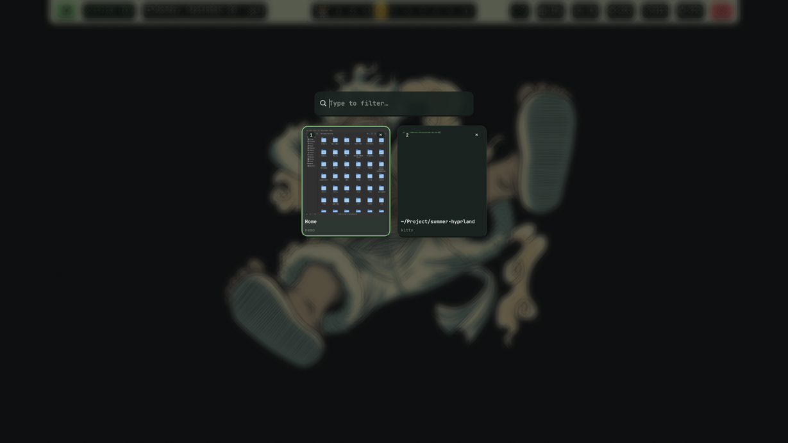
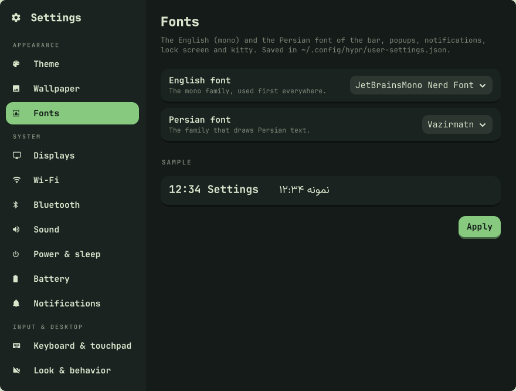
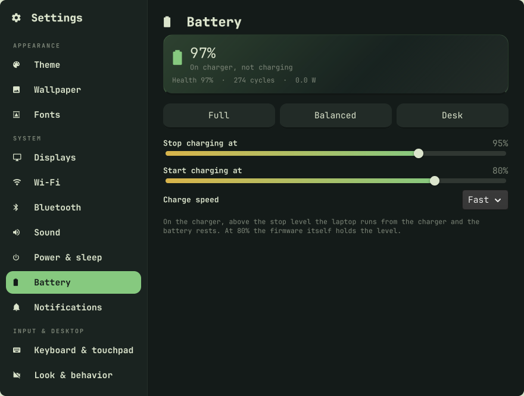

# Screenshots

Every app in this desktop, in the Straw Hat "zoro" theme. `tests/screenshots.sh`
takes these on a live session, so they stay in sync with the code.

Not shown: the clipboard popup (`SUPER+V`) — it would show your real clipboard
history.

## Desktop

The bar, with no windows open.

## Popups

### Sound (`SUPER+click` the volume icon)

### Quick settings (the battery/network area of the bar)

The Wi-Fi network and the Bluetooth device names are blurred.

### Wi-Fi (`SUPER+click` the Wi-Fi icon)

The network names are blurred.

### Power menu (`SUPER+B`)

Lock, sleep, reboot or power off; the idle behavior lives in Settings.

### Calculator (`SUPER+C`)

Standard, Scientific, Programmer, Converter, Date.

### Clock — calendar and world clock (click the bar clock, either button)

Calendar (Gregorian / Persian, with weather where you are) and up to 4
pinned timezones, in one popup. The weather location is blurred.

### Emoji picker (`SUPER+.`)

### Search everything (`SUPER+D`)

Shown on its Actions tab. The All tab also lists your most used apps and recent files.

### Displays (`SUPER+P`)

### Minimized windows (`SUPER+SHIFT+-`, or the bar's minimized counter)

A card per minimized window, newest first, with its icon, title, a number (1–9)
and a thumbnail, over a dimmed, blurred backdrop. Type to filter, arrows to move,
Enter or its number to bring one back, Delete / middle-click / its × to close it.

## Settings (`SUPER+I`)

### Theme

Pick a character; make, edit, rename or delete a custom one. The GIF section (the bar GIF, when it plays, the GIF on a theme switch) sits above the cards, and each card has GIF… and Remove.

### Wallpaper

One picture for every theme.

### Fonts

The English (mono) and the Persian font, from the installed families.

### Displays

Every screen and the arrangement, plus the selected screen's settings — on/off,
resolution, refresh rate, scale, rotation, mirror and brightness.

### Wi-Fi

### Bluetooth

### Sound

### Power & sleep

Power mode (Saver / Balanced / Speed), then the sleep timer and
lock / sleep / reboot / power off. The battery lives on the Battery page and
brightness on Displays.

### Battery

Charge level, state, health, cycle count and power draw; Full / Balanced / Desk
presets, "stop at" / "start at" sliders and charge speed — where the firmware's
`charge_types` can be limited. Read-only, with the fix-it command, where it can't.

### Notifications

### Keyboard & touchpad

### Look & behavior

## Theme editor

"New theme": name, four color pickers, a live preview, and Advanced.

